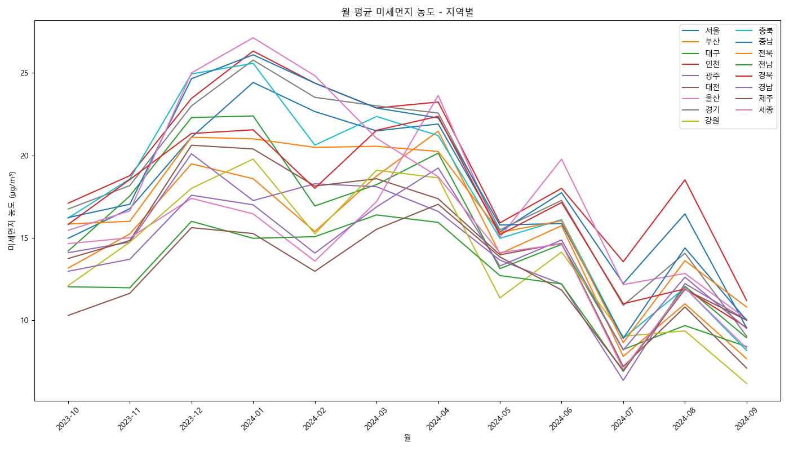
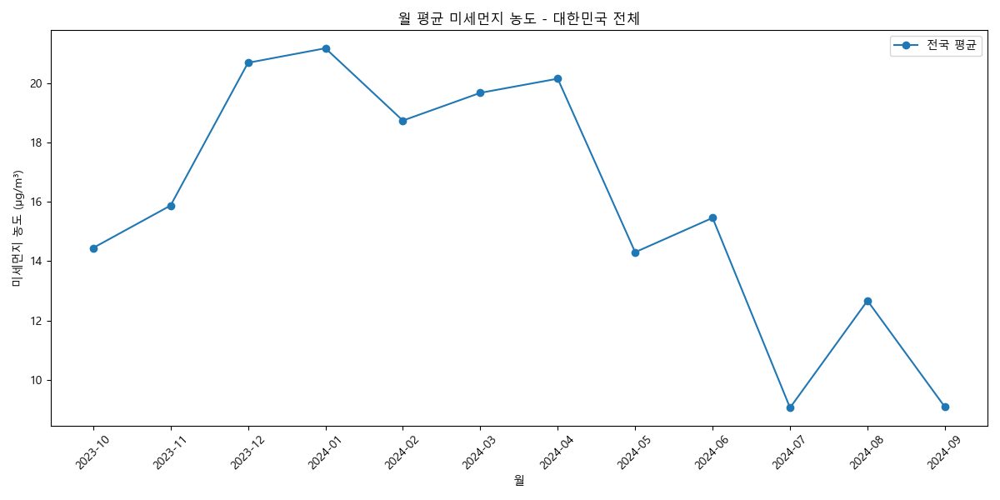
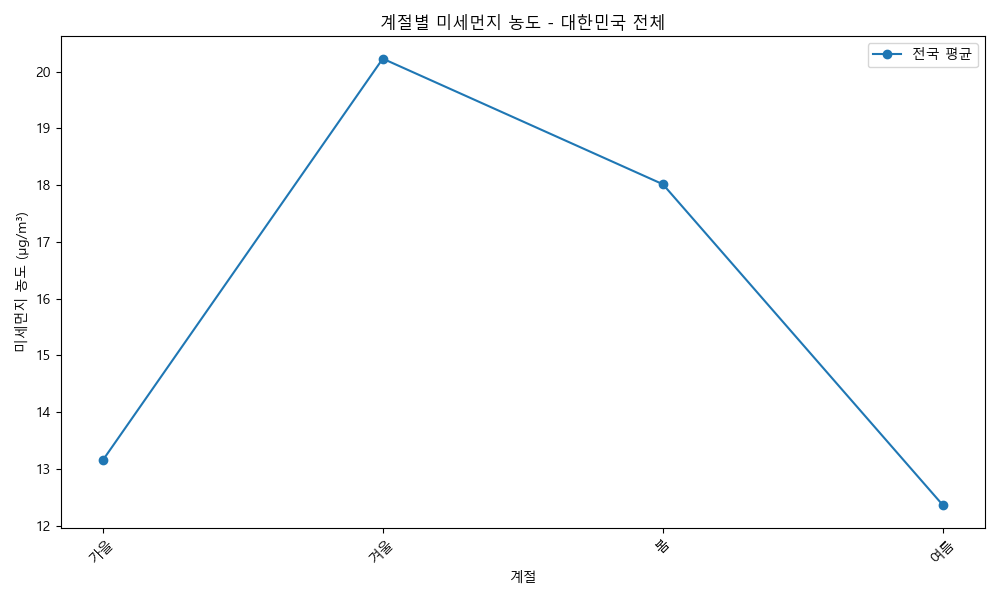

# K-미세먼지 분석

## 데이터 수집

최근 1년간의 미세먼지 데이터를 수집하였습니다. 
데이터는 2023년 10월 부터 2024년 9월까지의 데이터를 수집하였습니다. 
데이터는 한국환경공단의 에어코리아 사이트에서 수집하였습니다. 
 
데이터는 xls 파일로 제공되었습니다. 
xls를 일단 csv로 변환하였습니다. 
 
[merge_csv.py](merge_csv.py)를 이용하여 csv 파일을 하나로 합쳤습니다. 
 

## 데이터 분석

[main.ipynb](main.ipynb)을 통해 데이터를 분석하였습니다. 
 

## 데이터 시각화 결과

### 월 평균 미세먼지 농도 - 지역별

### 월 평균 미세먼지 농도 - 대한민국 전체

### 계절별 미세먼지 농도 - 지역별

### 계절별 미세먼지 농도 - 대한민국 전체
